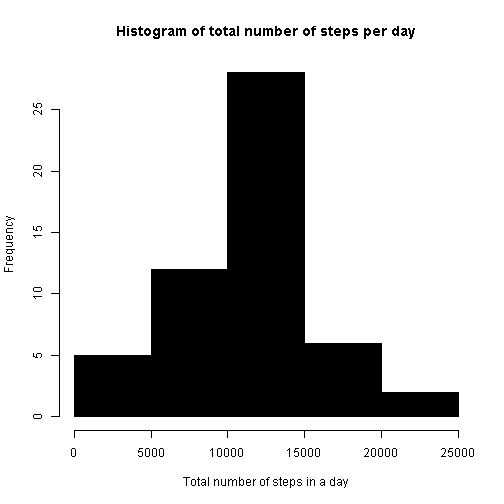
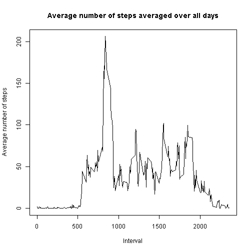
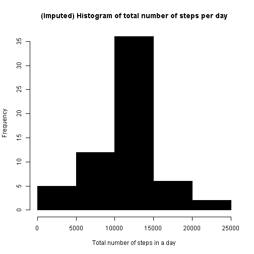
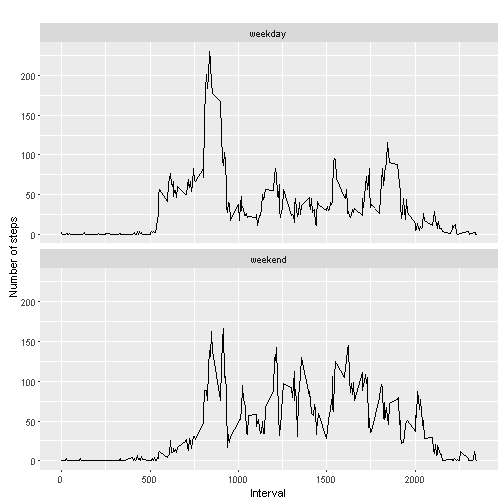

## 1: Code for reading in the dataset and/or processing the data

The data for this assignment can be downloaded from the course web site:

Dataset: Activity monitoring data [Download from Here](https://d396qusza40orc.cloudfront.net/repdata%2Fdata%2Factivity.zip)

The absolute location of the local directory where the file is stored and name of the file is "actvity.csv" is given below. Please change after you download the file from the following location:


```r
fpath <- "C:\\Users\\Arindam\\Desktop\\RWk1\\Wk2\\activity.csv"
# load the csv in data frame

activity_all <- read.csv(fpath)
activity_all$steps <- as.numeric(activity_all$steps)
activity_all$interval <- as.numeric(activity_all$interval)
```

Now as the first step done, we will move to the next step. 
## 2: Histogram of the total number of steps taken each day

```r
# generate df with complete cases only
activity <- na.omit(activity_all)
activity$steps <- as.numeric(activity$steps)
activity$interval <- as.numeric(activity$interval)

stepsCnt <- aggregate(steps~date,data=activity,FUN="sum")
hist(stepsCnt$steps,col=1, main="Histogram of total number of steps per day", 
     xlab="Total number of steps in a day")
```



## 3: Mean and median number of steps taken each day

As Mean & Median are computed for all days below

```r
mean(stepsCnt$steps)
```

```
## [1] 10766.19
```

```r
median(stepsCnt$steps)
```

```
## [1] 10765
```
And how about all the days? The mean of the steps by days would be interesting to see for all dates that are included in the dataset.

```r
meanSteps <- tapply(stepsCnt$steps, stepsCnt$date, mean)
medianSteps <- tapply(stepsCnt$steps, stepsCnt$date, median)
MeannMedian <- cbind(meanSteps, medianSteps)
MeannMedian
```

```
##            meanSteps medianSteps
## 2012-10-01        NA          NA
## 2012-10-02       126         126
## 2012-10-03     11352       11352
## 2012-10-04     12116       12116
## 2012-10-05     13294       13294
## 2012-10-06     15420       15420
## 2012-10-07     11015       11015
## 2012-10-08        NA          NA
## 2012-10-09     12811       12811
## 2012-10-10      9900        9900
## 2012-10-11     10304       10304
## 2012-10-12     17382       17382
## 2012-10-13     12426       12426
## 2012-10-14     15098       15098
## 2012-10-15     10139       10139
## 2012-10-16     15084       15084
## 2012-10-17     13452       13452
## 2012-10-18     10056       10056
## 2012-10-19     11829       11829
## 2012-10-20     10395       10395
## 2012-10-21      8821        8821
## 2012-10-22     13460       13460
## 2012-10-23      8918        8918
## 2012-10-24      8355        8355
## 2012-10-25      2492        2492
## 2012-10-26      6778        6778
## 2012-10-27     10119       10119
## 2012-10-28     11458       11458
## 2012-10-29      5018        5018
## 2012-10-30      9819        9819
## 2012-10-31     15414       15414
## 2012-11-01        NA          NA
## 2012-11-02     10600       10600
## 2012-11-03     10571       10571
## 2012-11-04        NA          NA
## 2012-11-05     10439       10439
## 2012-11-06      8334        8334
## 2012-11-07     12883       12883
## 2012-11-08      3219        3219
## 2012-11-09        NA          NA
## 2012-11-10        NA          NA
## 2012-11-11     12608       12608
## 2012-11-12     10765       10765
## 2012-11-13      7336        7336
## 2012-11-14        NA          NA
## 2012-11-15        41          41
## 2012-11-16      5441        5441
## 2012-11-17     14339       14339
## 2012-11-18     15110       15110
## 2012-11-19      8841        8841
## 2012-11-20      4472        4472
## 2012-11-21     12787       12787
## 2012-11-22     20427       20427
## 2012-11-23     21194       21194
## 2012-11-24     14478       14478
## 2012-11-25     11834       11834
## 2012-11-26     11162       11162
## 2012-11-27     13646       13646
## 2012-11-28     10183       10183
## 2012-11-29      7047        7047
## 2012-11-30        NA          NA
```

## 4. Time series plot of the average number of steps taken

What is the average daily activity pattern?

A time series plot (i.e. type = "l") of the 5-minute interval (x-axis) and the average number of steps taken, averaged across all days (y-axis)


```r
# aggregate steps as interval to get average number of steps in an interval across all days
table_interval <- aggregate(steps ~ interval, activity, mean)

# generate the line plot of the 5-minute interval (x-axis) and the average number of 
# steps taken, averaged across all days (y-axis)
plot(table_interval$interval, table_interval$steps, type='l', col=1, 
     main="Average number of steps averaged over all days", xlab="Interval", 
     ylab="Average number of steps")
```



## 5: The 5-minute interval that, on average, contains the maximum number of steps


```r
# find row id of maximum average number of steps in an interval
max_avg_steps_row <- which.max(table_interval$steps)

# get the interval with maximum average number of steps in an interval
table_interval [max_avg_steps_row, ]
```

```
##     interval    steps
## 104      835 206.1698
```

## 6: Code to describe and show a strategy for imputing missing data
First find out how many NA values that we have in scope.

```r
# get rows with NA's
df_NA <- activity_all [!complete.cases(activity_all),]
# number of rows
nrow(df_NA)
```

```
## [1] 2304
```

For performing imputation, we replace the NA by the mean for that 5-minute interval. We already have this data in the data frame "table_interval".
We loop across the rows of the original data frame. If the steps value is NA for a row, we find the corresponding value of interval. We then look up the steps value from the other data frame "table_interval" for this value of interval and replace the NA value with it.


```r
table_interval <- aggregate(steps ~ interval, activity, mean)

# perform the imputation
for (i in 1:nrow(activity_all)){
  if (is.na(activity_all$steps[i])){
    interval_val <- activity_all$interval[i]
    row_id <- which(table_interval$interval == interval_val)
    steps_val <- table_interval$steps[row_id]
    activity_all$steps[i] <- steps_val
  }
}
```

Next - 

a. Create a new dataset that is equal to the original dataset but with the missing data filled in.


```r
# aggregate steps as per date to get total number of steps in a day
table_imputed <- aggregate(steps~date,data=activity_all,FUN="sum")
```

## 7: Make a histogram of the total number of steps taken each day and Calculate and report the mean and median total number of steps taken per day. 


```r
# create histogram of total number of steps in a day
hist(table_imputed$steps, col=1, main="(Imputed) Histogram of total number of steps per day", xlab="Total number of steps in a day")
```



Do these values differ from the estimates from the first part of the assignment? What is the impact of imputing missing data on the estimates of the total daily number of steps?

```r
mean(table_imputed$steps)
```

```
## [1] 10766.19
```

```r
median(table_imputed$steps)
```

```
## [1] 10766.19
```

No change for Mean, but median is slightly different as we have more observations included.


## 8: Panel plot comparing the average number of steps taken per 5-minute interval across weekdays and weekends


First, we are creating a new factor variable in the dataset with two levels - "weekday" and "weekend" indicating whether a given date is a weekday or weekend day.

First convert date from string to Date class

```r
activity_all$date <- as.Date(activity_all$date, "%Y-%m-%d")
```
then add a new column indicating day of the week 

```r
activity_all$day <- weekdays(activity_all$date)
```

Add a new column called day type and initialize to weekday
If day is Saturday or Sunday, make day_type as weekend


```r
activity_all$day_type <- c("weekday")

for (i in 1:nrow(activity_all)){
  if (activity_all$day[i] == "Saturday" || activity_all$day[i] == "Sunday"){
    activity_all$day_type[i] <- "weekend"
  }
}

activity_all$day_type <- as.factor(activity_all$day_type)
```

Aggregate steps as interval to get average number of steps in an interval across all days


```r
table_imputed2 <- aggregate(steps ~ interval+day_type, activity_all, mean)
```

So the data is now ready. Time to plot.


```r
# make the panel plot for weekdays and weekends
library(ggplot2)
qplot(interval, steps, data=table_imputed2, geom=c("line"), xlab="Interval", 
      ylab="Number of steps", main="") + facet_wrap(~ day_type, ncol=1)
```



### Dont forget to cleanup the cache

```r
##Clearing the temp variables
rm(list=ls())
```
